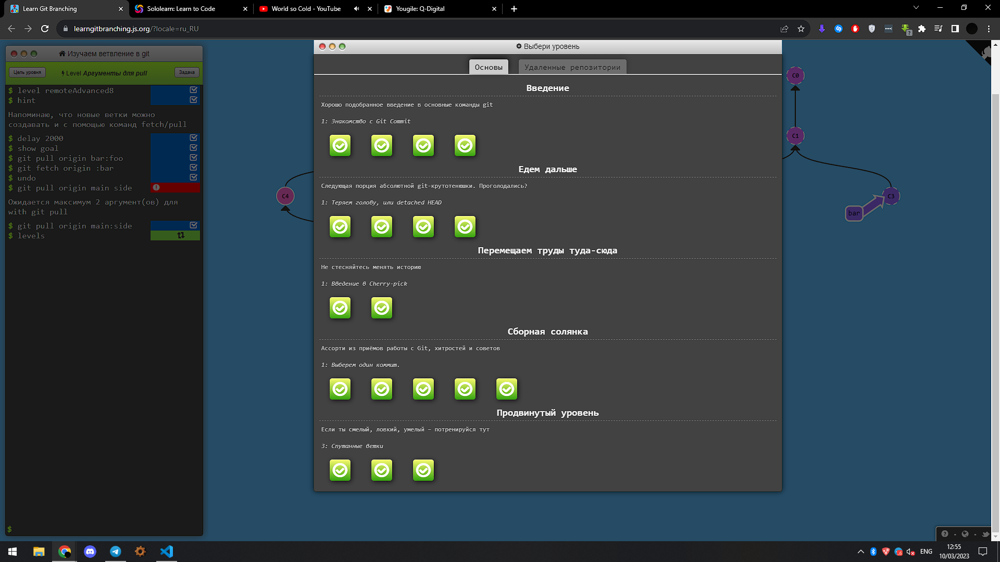
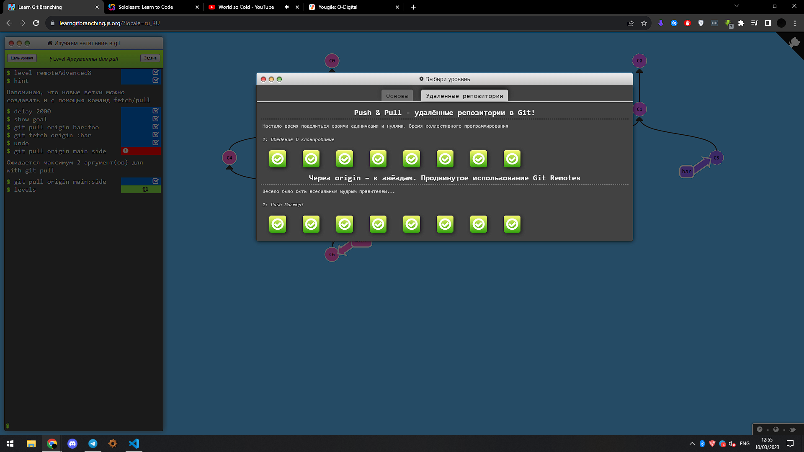
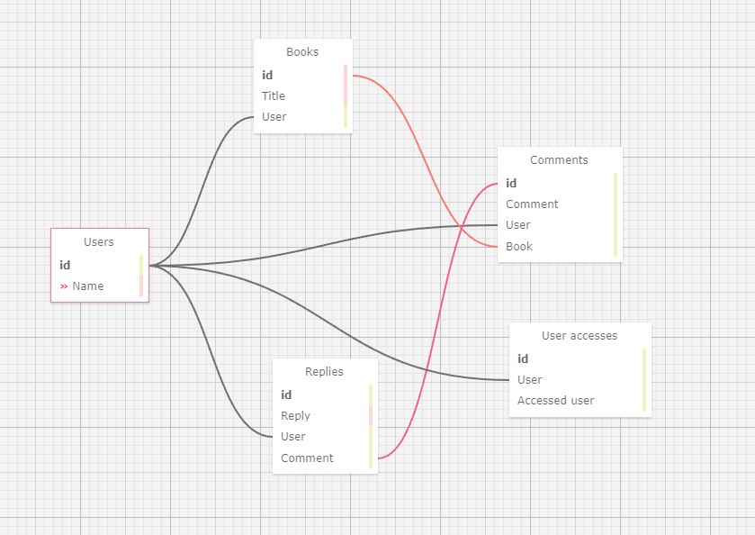
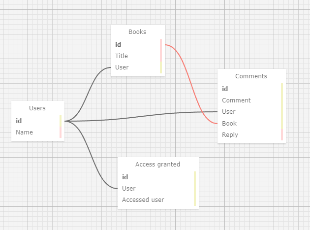

<h1>GIT. Задача 1</h1>
    <ul>
        <li>
        Ссылка:
            <ul type = 'circle'>
                <li>
                    https://github.com/scifighter/hello
                </li>
            </ul>
        </li>
    </ul>
<h1>GIT. Задача 2</h1>
<ul>
    <li>
    Скриншоты:
    
    
    </li>
</ul>
<h1>GIT. Задача 3</h1>
<ul>
    <li>
    Скриншоты:
    
    </li>
</ul>
<h1>GIT. Задача 4</h1>
<ul>
    <li>
    Скриншоты:
    
    </li>
</ul>